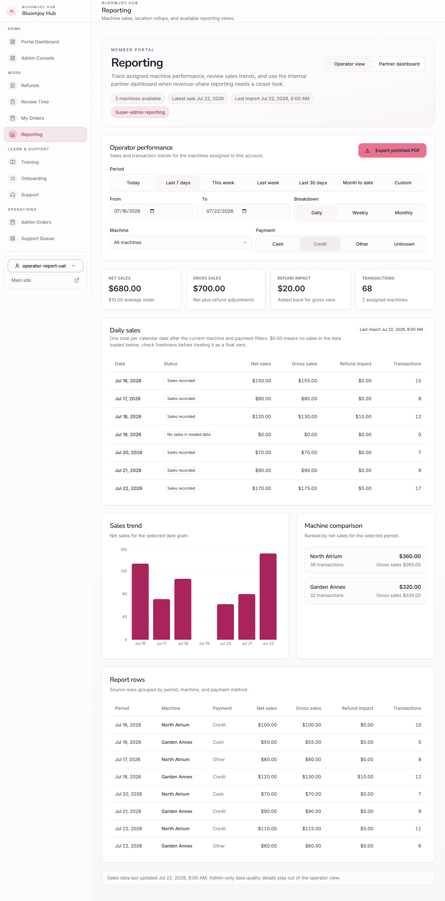
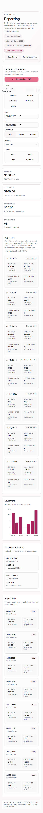
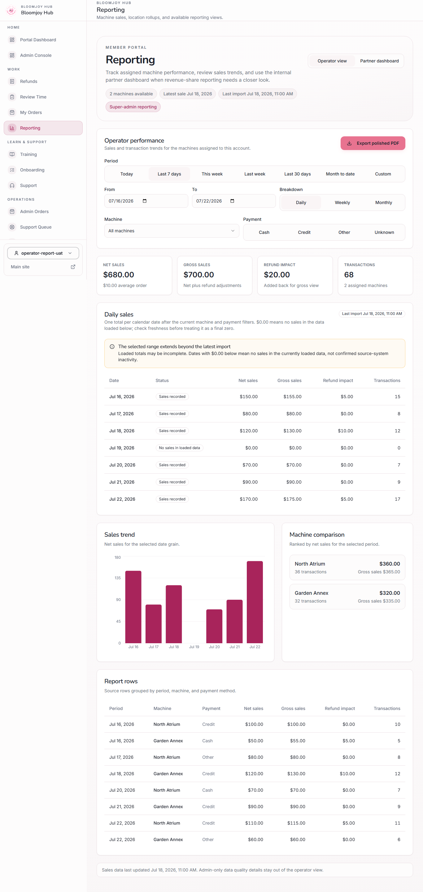
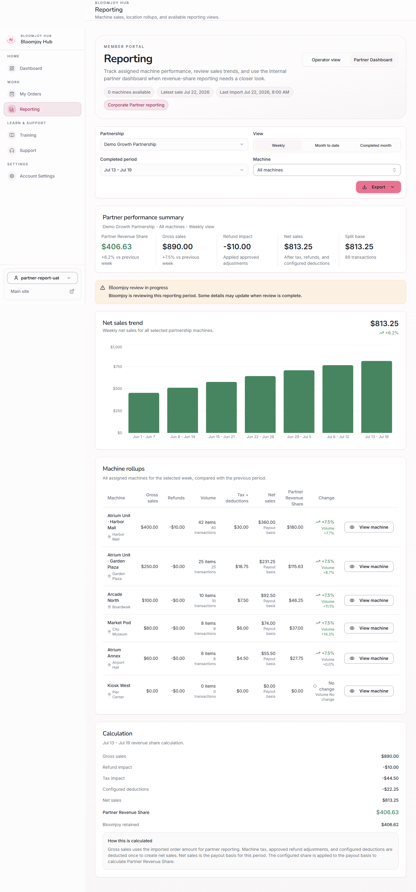
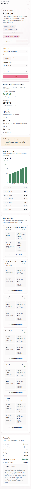
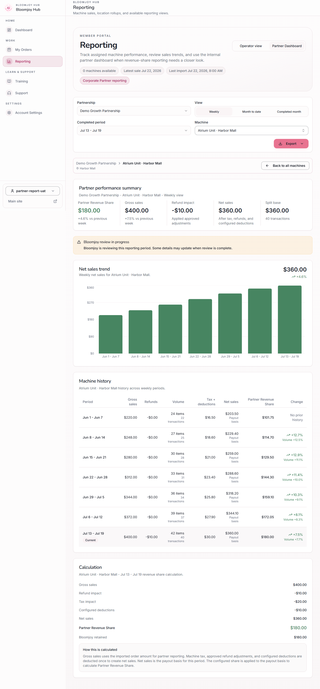
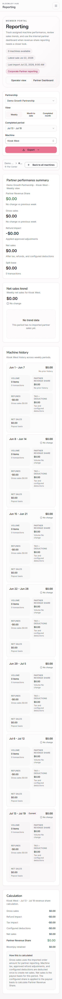

# Reporting UAT evidence — issue #647

All evidence below uses deterministic, intercepted authentication and RPC responses. The fixture data is synthetic and contains no customer data, credentials, or production identifiers. The browser clock is fixed at July 22, 2026.

## Reconciliation proof

- Operator Last 7 days: **$680.00 net**, **$700.00 gross**, **$20.00 refunds**, and **68 transactions**. The seven daily rows reconcile to those KPIs, including July 19 as an explicit `$0.00` `No sales in loaded data` date.
- Partner all machines: **$890.00 gross**, **$813.25 net**, and **$406.63 Partner Revenue Share** across six assigned machines. The fixture includes two `Atrium Unit` machines at different locations and one assigned zero-sales machine.
- Selected `Atrium Unit · Harbor Mall`: **$400.00 gross**, **$360.00 net**, and **$180.00 Partner Revenue Share**. The machine scope is retained across summary, trend, history, calculation, warning, and export assertions.

The full 24-check browser result is in [reporting-uat-results.md](reporting-uat-results.md). Run it with:

```bash
npm run reporting:validate-portal-uat -- --app-url http://127.0.0.1:8081
```

## Owner-review screenshots

### Operator — desktop daily view



### Operator — mobile daily view at 390px



### Operator — zero sales distinguished from stale import coverage



### Partner — all machines with locations and drilldown actions



### Partner — all machines on mobile at 390px



### Partner — selected machine scope, history, and calculation



### Partner — selected zero-sales machine on mobile



## Release gate

These artifacts are for owner review. Do not merge if merging releases production, and do not otherwise deploy this work, until the owner explicitly approves the screenshots in issue #647.
