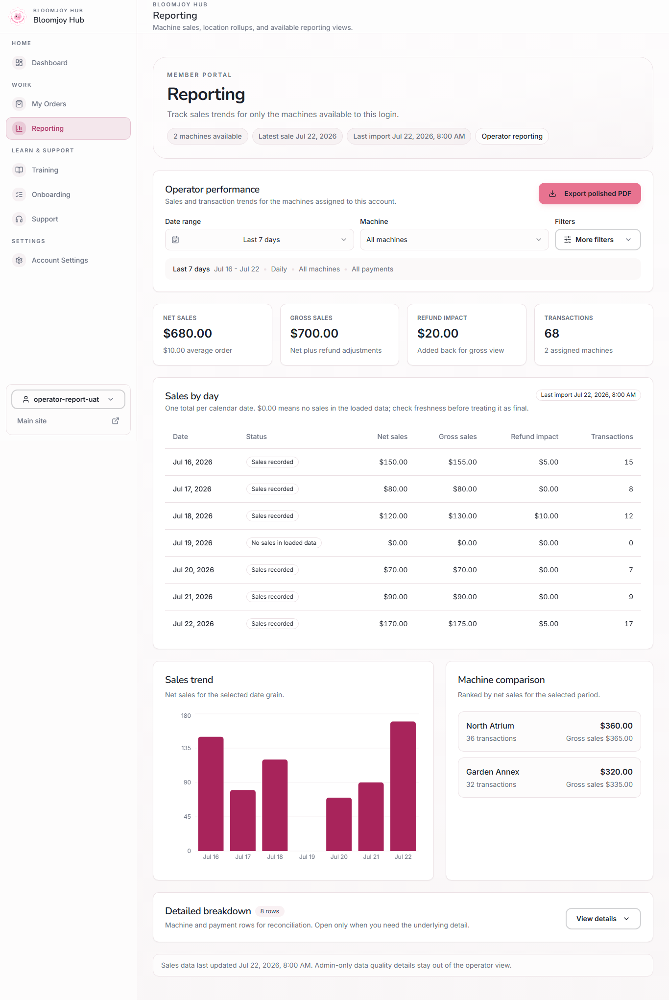
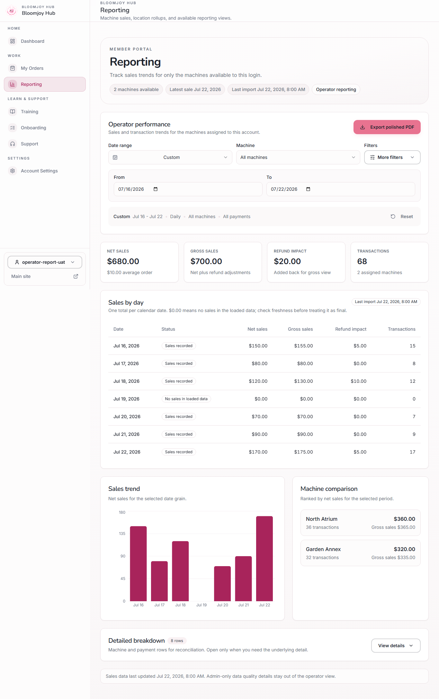
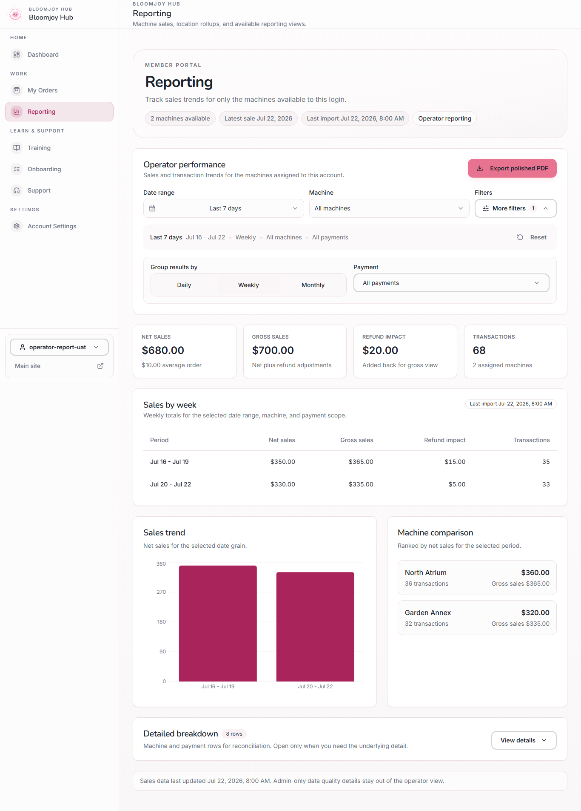
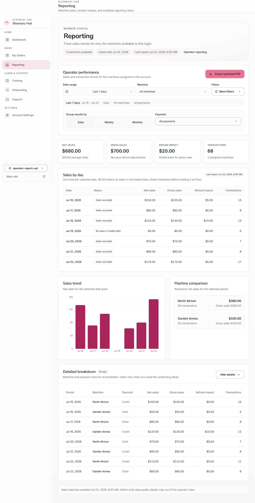
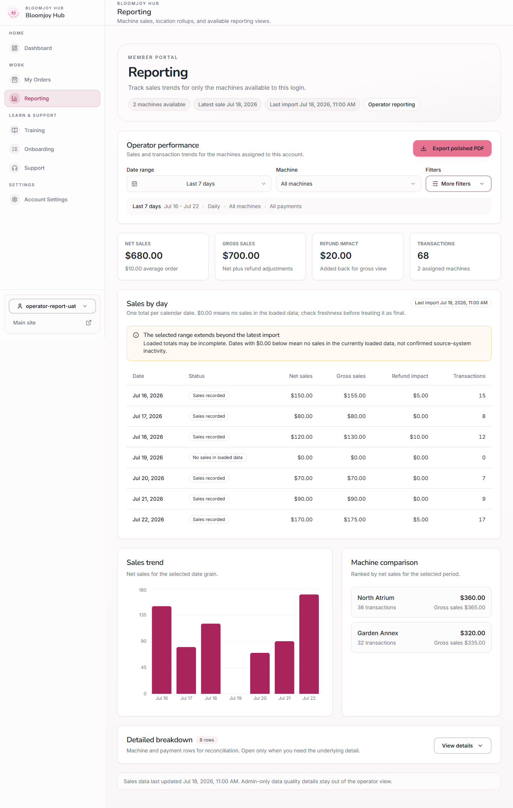
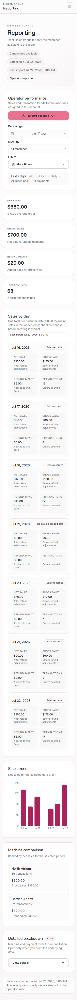
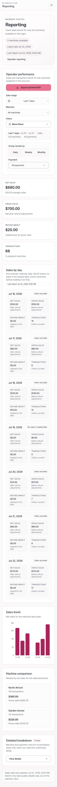
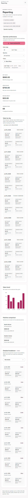
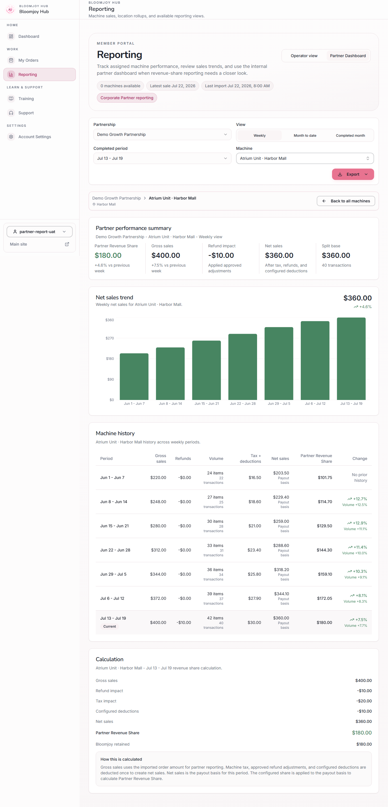

# Operator reporting UX review packet

Issues: [#656](https://github.com/ethtri/bloomjoy-hub/issues/656) and [#657](https://github.com/ethtri/bloomjoy-hub/issues/657)

Status: **Ready for executive screenshot review; not approved for merge**

## What changed

- The primary filter path now shows Date range, Machine, More filters, and Export.
- All seven date presets remain available from one control.
- Custom dates appear only after Custom is selected.
- Daily, Weekly, Monthly, and payment choices live under More filters.
- The applied-filter summary and conditional Reset action make the current scope explicit.
- Sales by day/week/month is the one primary summary.
- Detailed breakdown is collapsed by default and retains every machine/payment reconciliation row.
- The rejected “Bloomjoy review in progress” notice is absent from the UI and final artifacts.

## Desktop review

### Compact default

### More filters

### Payment choices

### Custom date range

### Weekly summary

Partial week labels are clamped to the actual selected dates.

### Detailed breakdown expanded

### Zero sales versus stale coverage

## Mobile review at 390px

### Compact default

### More filters

### Detailed breakdown expanded

## Partner notice regression check

The selected-machine partner view remains clear of the rejected review-in-progress notice.

## Authenticated-browser result

- **32/32 checks passed**
- Sanitized, intercepted authentication and reporting fixtures only
- Exact daily KPI/summary/detail reconciliation passed
- Weekly totals and partial-period labels passed
- Machine/payment filter and export scope passed
- Compact and expanded layouts passed at 360px, 390px, 414px, and desktop
- Keyboard, touch-target, permission, signed-out, and partner regression checks passed
- No unexpected browser errors

See [reporting-uat-results.md](./reporting-uat-results.md) and [reporting-uat-results.json](./reporting-uat-results.json).

## Release gate

Do not merge the draft PR and do not deploy this change until the executive sponsor has reviewed these screenshots and commented explicit approval.
