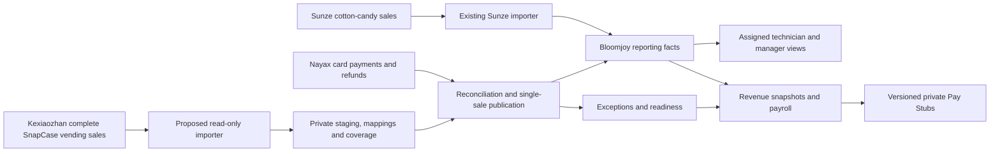

# SnapCase sales discovery and proposed integration

Planning spike, 2026-09-26. No integration, migration, configuration, credential,
machine assignment, production record, or deployment was changed by this spike.
The architecture below is a proposal; it is not an activation authorization.

## Recommendation in plain English

Bring complete SnapCase vending activity, including cash, from Kexiaozhan into
Hub. Use Nayax to verify card payments and refunds. Count each purchase once.
Keep Sunze's cotton-candy pipeline intact. Before publishing a commission-bearing
Pay Stub, prove that the required machine sales windows are complete, rather than
assuming that the rows already imported are the whole month.

Reuse selectively. `Snapcase_Web` has a real, tested checkout/payment integration,
not a complete vending-sales importer. Hub's closed, unmerged PR #608 contains a
more relevant reporting connector, staging schema, and reconciliation prototype.
Reassess that code against current main; do not merge the stale branch wholesale.

## Evidence and limits

- Hub inspected at `0af99919` on a dedicated worktree; Snapcase_Web, whose GitHub
  repository is `ethtri/case-creator-studio`, inspected at `ad1ed9a`. The original
  Snapcase_Web checkout was behind remote main, so discovery used a fresh worktree.
- PR #608 is closed **without merge**. Its retained branch commit is
  `2c18a248c886879221b97a0bc0fe2746df1fc23e`. Its July observations are historical
  evidence, not fresh proof of provider availability or contract correctness.
- Read-only Hub production SQL on September 26 found 82,134 sales facts, all
  `sunze_browser`, covering dates 2025-08-01 through 2026-09-26. This date span does
  not establish continuous coverage. There were 111 completed Sunze import runs
  in the preceding 35 days; the latest completed at 17:21:47 UTC September 26.
- The production machine registry contained eight `snapcase` records, six with
  Nayax mappings and none with Sunze mappings. These counts include all statuses
  and are not an owner-approved active-machine roster.
- No #608 reporting staging tables or SnapCase importer were found in Hub
  production. The deployed function list includes Sunze ingest, report exports,
  report scheduler, Gmail intake, and pay-stub-generator.
- #1471's Nayax-only importer is merged in #1472/#1473, but at this inspection
  production had no Nayax sales facts or `service_ingest_nayax_scheduled_sales`.
  Recheck #1471 before implementation; its release may advance independently.
- Production cron metadata showed four refund/Gmail jobs, no dedicated pay-stub
  or report scheduler job. Function deployment alone does not prove scheduling;
  any external pay-stub/report trigger remains unverified.
- No raw transactions, payment identifiers, customer information, secret values,
  authenticated vendor sessions, or source exports were retrieved for this spike.
  No report RPC that can refresh snapshots was invoked.

## What exists today

### Sunze

`scripts/sunze/sync-orders.mjs` uses Playwright/Chromium to sign into Sunze and
request the Orders Export Task. It downloads XLSX or ZIP workbooks, parses them
with `sunze-orders.mjs`, validates headers and date windows, and deletes raw
downloads. Node, Playwright and the workbook parser are existing dependencies.
The service-account credentials remain GitHub secrets. `REPORTING_INGEST_TOKEN`
authenticates the server ingest endpoint; `REPORTING_ROW_HASH_SALT` hashes orders.

The daily workflow reads Last 7 Days with overlap at 13:30 and 17:30 UTC, with a
Last Month sweep on the first at 14:45 UTC. Separate recovery and daily health
workflows detect failures/staleness; import diagnostics and email/WeCom alerting
already exist. Recent scheduled runs succeeded, including run 36258665413.

`sunze-sales-ingest` validates payment/status/machine data and calls
`upsert_sunze_sales_facts`; source order identity supports idempotent updates and
row hashes detect changed content. Unknown machines are retained in
`sunze_machine_discoveries` / `sunze_unmapped_sales` for mapping and replay.
`reporting_machines.sunze_machine_id` links a source device to Hub's canonical
machine, location and customer account. Display names are not identity keys.

Cash (`Coin + Notes`), credit (`Credit card`) and other (`No-Pay`) are distinct.
The export has order number, product, machine code, amount, tax, payment method,
payment time and status. Quantity is not independently established from the export.
Timezone-less Sunze timestamps retain explicitly unvalidated compatibility
semantics; do not change them as a side effect of SnapCase work.

`machine_sales_facts` and `sales_adjustment_facts` feed portal reports, PDF/CSV
exports, partnership calculations, machine revenue snapshots and technician pay.
The historical field name `net_sales_cents` is misleading: current pay and partner
calculations treat the source sale amount as sales before separately subtracting
refunds and configured tax. Specify each amount's meaning; do not silently rename
or reinterpret Sunze financial measures.

### Snapcase_Web and the more relevant Hub prototype

Snapcase_Web implements signed vendor-designer handoff -> Stripe checkout ->
server-confirmed payment -> Kexiaozhan deferred-print notification. Its
`kexiaozhan_handoffs`, `orders` and `production_jobs` concern that online ordering
journey. Its growth-reporting contract is ecommerce/marketing measurement.
Neither is evidence of a complete all-machine cash-sales ledger.

The documented fixed APIs are `POST /client/process-payment-notify` and
`GET /client/query-status`, signed with HMAC-SHA256 using backend-only
`KEXIAOZHAN_MACHINE_KEY`. Query-status accepts a known payment and machine serial;
it returns paid/unpaid status, not an all-machine transaction history. The notify
endpoint changes payment/fulfillment state and must never be used by reporting.
The payment docs identify separate test and production domains. Do not assume
those `/client` credentials or domains authorize the merchant reporting API.

Reusable candidates are pure signature/response-validation helpers, synthetic
tests, replay/concurrency handling and documented vendor field definitions:
`supabase/functions/_shared/kexiaozhan-payment.ts`, `kexiaozhan-api-response.ts`,
`kexiaozhan-payment-transaction.ts`, `kexiaozhan-handoff.ts` and their tests.
`kexiaozhan-reconciliation.ts` reconciles failed fulfillment notifications, not
Nayax versus cash/card revenue. Do not copy its name/behavior as sales logic.
The checkout integration is implemented and staging-tested; the current status
document still describes controlled onshore pilot gates. It is not a proven
production fleet-reporting integration. No code was copied during this spike.

Hub PR #608 historically observed a private merchant API at
`https://kxzcnt.kexiaozhan.com/mer`: login `POST /user/login`, then bearer-authenticated
`GET /v1/machines`, `/v1/orders`, `/v1/payments`, with `X-App-Language` and
`X-App-TimeZone`. Its worker uses Node fetch, paginated reads, `type=1` phone-case
orders and payment-time filters, a 35-day overlap, a locked ingest Edge Function
and shadow-only Postgres tables. It is neither browser scraping nor a scheduled
vendor export. The XLSX adapter is only a proposed fallback.

That prototype requires repair before reuse: it can accept an empty intermediate
page as completion, lacks a demonstrated timeout/retry contract, assumes two
decimal minor units and inferred numeric tender meanings, and has unproved
timestamp/production-host semantics. It also needs current account scoping,
strict response schemas, source-key hashing review and integration with #1471.
Revalidate salted reference matching across providers; differently namespaced
hashes cannot establish equality without an explicit protected linking key.

| Required field | Evidence available | Remaining proof |
| --- | --- | --- |
| Machine / merchant | #608 `id`, `machineSn`, `machineId`, `merchantId`, device type | Current ownership, stable keys, moves/replacements and production account |
| Transaction identity | `orderNo`, `outTradeNo`, `orderNos[]`; payments may cover several orders | Stable ID scope, split/grouped payments and link semantics |
| Time | `createTime`, `paymentTime`, `finishTime`; some naive strings | Clock basis, headers, offset/DST, updated-since semantics |
| Cash / credit | `paymentMethod`, `paymentInstrument`; prototype infers cash/credit | Vendor-confirmed cash, coin, test/free, mixed and other-tender meanings |
| Money / currency | `orderAmount`, `paymentAmount`, discounts, tips; machine currency fallback | Gross/net, minor units, multi-currency and cash change treatment |
| Refunds | `refundAmount`, source statuses | Partial/full refunds, reversals, cumulative versus event values, effective date |
| Product / tax | `goodsName`, `taxRateAmount`, optional quantities | Product identity, tax-inclusive/exclusive basis and reliable quantity |
| Settlement | Order/payment status and paid/unpaid query | Paid is not proved settled; Nayax supplies authoritative card state |

The precise access blocker is a supported read-only merchant reporting contract,
confirmed production endpoint/account and safely provisioned reporting credentials
under #605. Existing machine payment keys do not solve this. The older issue
records a browser-snapshot credential rotation requirement; its completion was
not verified. Do not reuse that snapshot or send credentials through GitHub/chat.

## Proposed architecture and authority

| Source | Authority | Publication rule |
| --- | --- | --- |
| Sunze | Cotton-candy vending sales, including its tender split | Keep existing importer and calculations; do not add Nayax card rows for Sunze machines |
| Kexiaozhan | Intended complete SnapCase vending population, cash and order/product context, once contract verified | Recognized cash once; card orders link to payment evidence, never add a second card sale |
| Nayax | Authoritative card payment value/status and refunds | One canonical card fact per provider transaction; settlement and authorization are separate observations |
| Hub | Physical machine/account/assignment scope, report projection and readiness | Audited effective-dated mapping; never infer complete sales from Nayax alone |

Model vending events separately from payment observations and refunds. A cash
event contributes once after its tender, amount and successful-sale semantics are
proved. A card event links to exactly one canonical Nayax payment; a grouped
payment may allocate to several order lines only when the allocation is proved
and sums exactly to its amount. Unknown/mixed tenders remain exceptions.
Do not count order count and payment count as the same metric.

Prefer a proved shared payment reference plus account/machine binding. A unique
same-machine/time/amount/currency candidate is proposed evidence, not proof;
ambiguous or missing links remain visible exceptions. Enforce database uniqueness
on payment allocation, source identity and financial publication. Differences in
amount, tax, time or status create reasoned exceptions; neither source overwrites
the other. No match never means no cash sale or no refund.

For #1471 coexistence, retain Nayax's canonical card fact identity and attach
Kexiaozhan order context. Never publish another Kexiaozhan credit amount beside
it. Add explicit per-machine, effective-dated source ownership instead of relying
only on the absence of a Sunze ID. Migrate/prove ownership atomically for any
already imported rows. Existing settled-only rows may be visible as partial card
revenue; they cannot prove complete SnapCase revenue.

Refunds are separately identified financial events linked to the canonical
purchase. Nayax successful refund observations and existing Hub refund
adjustments must resolve to one adjustment, not one deduction per source. Pending
or unknown outcomes are not refunded revenue. Cash reimbursements use the
existing confirmed Hub cash-refund evidence; Kexiaozhan refund amounts are
corroboration until their semantics are proved. Preserve partial refunds,
reversals, refund-date reporting and the original purchase link. Do not change
the existing one-decision customer refund workflow.

### Data contract and identity

Adapt #608's provider-account, merchant/machine discovery, order/payment staging,
payment-order links, Nayax observations, reconciliation and change-log concepts.
Add explicit coverage intervals, expected-machine windows, exception resolution,
canonical publication lineage and period readiness. These are proposed schema
changes only; table names and migrations must be reviewed during implementation.

Each normalized record needs tenant/provider account, stable source-event keyed
hash and hash-key version, canonical machine/location at occurrence time,
source revision/digest, order/payment relationship, occurrence and settlement
instants separately, original clock basis, business date and IANA timezone,
currency and integer minor-unit amounts, tender, product/quantity when proved,
sale/tax/discount/tip/refund components, raw status plus normalized status,
import-run lineage, reconciliation state and publication revision. Missing tax or
currency is unknown, never silently zero or USD. An approved effective machine
tax rule may supply derived tax with explicit provenance, preserving the current
pay calculation; missing imported tax alone must not override that valid rule.
USD-only initial admission is a
proposal to confirm against the actual roster; other currencies remain explicit.

Unique source identity is provider + account + stable event ID; row revisions
update observations without creating a new sale. Store only allowlisted fields,
not arbitrary provider JSON. Sensitive matching references stay private or keyed
hashed; operators get safe local references. Key rotation must preserve identity
with a versioned transition, never silently create new financial events.

Map provider IDs/serials and Nayax account/device IDs to the same canonical Hub
machine using verified ownership. Keep reporting location, legal payer/customer
account, partnership, and technician compensation assignments separate. Use
effective dates for relocations and ownership changes; never map by name alone.
Unknown machines/merchants enter a restricted queue with earliest affected date,
row count, reason and retry action. Mapping approval replays retained records
idempotently and invalidates affected readiness; it does not rewrite assignments.

Convert verified source times to UTC; derive sale business date using the
machine/location timezone effective when the sale occurred. Payroll calendar
cutoff remains America/Los_Angeles. Keep settlement time separately: #1471 uses
settlement-local date today, so migration to occurrence-date reporting requires
an explicit accounting decision and comparison, not silent historical redating.
Ambiguous DST folds/gaps and unknown source clocks require evidence. Zero-sales
days are valid when the provider proves complete coverage for that window.

### Operations, backfill and security

Use the existing Node/GitHub Actions + Supabase pattern; no new hosting platform.
Start disabled, run shadow ingestion, then enable publication independently.
Prefer supported API access; if unavailable, use a supported export adapter into
the same normalized contract. Do not attach payment/print capabilities to the worker.

Proposed initial cadence: daily with a backup trigger and rolling 35-day reads,
bounded by vendor limits; month-end sweeps cover the full just-closed period.
Confirm latency needs before changing cadence. Require per-account concurrency
locks, request timeouts, bounded exponential retry/jitter, Retry-After handling,
token refresh, resumable pages/chunks and independent scheduler heartbeat checks.
Never advance coverage after partial pagination, truncation, rejected rows,
unverified empty responses, or missing expected devices. Late older corrections
need an updated-since endpoint or scheduled deeper replay; 35 days is not universal
refund completeness. Record queried-through coverage separately from last sale.

Backfill owner-approved machine-active periods in bounded monthly chunks with
source totals/control counts, dry-run comparison, checkpoints and idempotent
replay. Separate historic snapshots/Pay Stub corrections from current publication;
do not silently revise issued payroll. Gaps become exceptions, never zeros.

Use separate reporting credentials per environment, encrypted GitHub environment
secrets and server-only ingest/HMAC secrets, least-privilege private staging and
RLS/RPC role checks. Tokens stay in memory. Do not expose credentials, provider
payment IDs, customer content, logs or exports in UI/CI artifacts. Validate HTTPS
egress destinations and response schemas. Confirm raw-evidence retention/deletion
and credential rotation ownership before the future credential-provisioning task.

Health shows last attempted/successful run, actual covered-through window per
machine/source, missing windows, unmapped/quarantined counts, card/refund residuals,
backlog age and publication lag. Deduplicate failure/recovery alerts through the
existing operations channels. Admin actions are scoped retry, mapping review,
exception evidence and replay; none can issue a payment or operate a machine.

## Payroll readiness and user experience

Confirmed live gap: `private.normalize_technician_pay_report_status` removes some
closed-month freshness blockers when a refreshed revenue snapshot matches current
facts. `get_current_technician_pay_report_context` refreshes those snapshots.
Agreement with imported facts does not prove an absent SnapCase source arrived.
Adding card facts alone could therefore make partial revenue look current.

Introduce one derived status per machine-period and roll it up per Technician /
legal payer: **Ready**, **Waiting for sales**, **Needs review**. Show a specific
reason, required window, covered-through date, cash/card totals and exception count.
Open months remain labeled estimates. Missing SnapCase data says “Cash sales not
yet available” or “Waiting for machine sales,” never a misleading zero total.

Readiness derives from the expected machine roster and effective assignments,
not machines that happen to have rows. Ready requires complete required source
windows including verified zero-sales windows, resolved mapping/tender/time/currency
issues, reconciled card/refund evidence, and unchanged input/coverage revisions.
Scope publication holds to statements whose calculation requires those missing
inputs; do not block unaffected technicians or fixed-pay inputs unnecessarily.

Managers open the monthly Pay Report, see expected versus covered machines,
inspect only missing windows or exceptions, correct a mapping or provide verified
alternative evidence, and let the system recompute readiness. Any exception
resolution records actor, evidence, reason, scope and revision. A click acknowledging
missing data cannot manufacture completeness. This is data confirmation, not a
new monthly approval or proof-of-payment step.

Enforce readiness server-side on legacy finalize/issue paths and automatic
`service_prepare_pay_stub` / `service_complete_pay_stub`, with an atomic revision
check so late imports cannot race PDF publication. Keep automatic publication
after the fourth-day technician cutoff; blocked requests retain actionable reasons
and retry after evidence arrives. Late corrections mark affected statements and
later same-year YTD versions stale; regeneration creates immutable new versions.

General reporting access and payroll attribution are different. Reporting uses
`has_reporting_machine_access`, customer membership, effective reporting
entitlements, scoped-admin and corporate-partner scope. Technician grants and
machine assignments resolve effective access. Payroll additionally uses
`operator_payout_profiles` and effective-dated `operator_machine_assignments`.
Do not assume granting reporting access creates compensation entitlement.
Technicians see only authorized machines and their own current Pay Stubs; managers
see only their authorized accounts/machines. Exports must carry the same partial
data warning/readiness metadata as the page.

## Affected surface inventory

This is the discovered direct and downstream impact boundary; implementation
must recheck dependency changes against current main and deployed definitions.

| Layer | Existing surfaces to preserve or adapt |
| --- | --- |
| Identity / access tables | `customer_accounts`, `customer_account_memberships`, `reporting_locations`, `reporting_machines`, `reporting_machine_aliases`, `reporting_machine_entitlements`, `technician_grants`, `technician_machine_assignments`, scoped-admin/corporate-partner grants, `operator_payout_profiles`, `operator_machine_assignments`, `admin_audit_log` |
| Sales / source tables | `machine_sales_facts`, `sales_adjustment_facts`, `sales_import_runs`, `sunze_machine_discoveries`, `sunze_unmapped_sales`, `sunze_cash_source_readiness`, `sunze_cash_source_watermarks`, `refund_nayax_machine_inventory`, `refund_nayax_inventory_runs`, `nayax_scheduled_report_messages`, `nayax_scheduled_report_files`, `nayax_scheduled_report_provider_run_observations`, `nayax_scheduled_refund_observations`; #1471 adds `nayax_scheduled_sales_ingestions` |
| Report tables | `report_view_snapshots`, `report_schedules`, `report_schedule_recipients`, `reporting_partners`, `reporting_partnerships`, `reporting_partnership_parties`, `reporting_machine_partnership_assignments`, `reporting_partnership_financial_rules`, `reporting_machine_tax_rates`, `partner_report_snapshots`, `partner_report_schedules`, `partner_report_schedule_recipients`, `partner_report_schedule_runs`, `partner_report_email_attempts` |
| Pay tables / artifacts | `time_entries`, `compensation_rules`, `operator_recurring_compensation_items`, `payout_policies`, `payout_periods`, `payout_period_machine_revenue_snapshots`, `payout_runs`, `payout_run_items`, `payout_run_item_machines`, `payout_run_review_snapshots`, `payout_adjustments`, `pay_stub_generation_requests`, `pay_statements`, private statement PDFs and export storage |
| Reporting RPCs | `get_my_reporting_access_context`, `get_reporting_dimensions`, `get_sales_report` overloads, `create_report_export`, `admin_get_reporting_access_matrix`, `admin_get_sunze_machine_mapping_queue`, `admin_map_source_machine_to_partnership`, `admin_preview_partner_period_report` / `_internal`, `admin_preview_partner_weekly_report`, `get_partner_dashboard_partnerships` and scheduled partner run claim/complete paths |
| Source / adjustment RPCs | `upsert_sunze_sales_facts`, `service_record_sunze_cash_watermarks`, `service_correlate_sunze_cash_import`, #1471 `service_ingest_nayax_scheduled_sales`, `service_get_nayax_report_message`; preserve existing refund-adjustment dedupe and settlement paths |
| Pay / authorization RPCs | `has_reporting_machine_access`, `reporting_machine_ids_for_user`, `technician_machine_ids_for_user`, `operator_can_access_payout_revenue_snapshot_row`, `operator_revenue_snapshot_source_values`, `admin_generate_payout_revenue_snapshot[s_for_period]`, `admin_override_payout_revenue_snapshot`, `get_payout_revenue_snapshot_context`, `get_current_technician_pay_report_context`, `get_technician_pay_report_context`, `private.calculate_technician_pay_report` and wrapper implementations, `private.operator_machine_tax_snapshot`, `private.operator_machine_tax_commission`, `private.normalize_technician_pay_report_status`, `private.operator_pay_stub_regeneration_required`, `admin_calculate_payout_run`, `admin_finalize_payout_run`, `admin_preview_pay_statements`, `admin_issue_pay_statements`, `admin_request_pay_stub_generation`, `service_enqueue_automatic_pay_stubs`, generation claim RPCs, `service_refresh_pay_stub_revenue_snapshot`, `service_prepare_pay_stub`, `service_complete_pay_stub`, `service_fail_pay_stub`, statement context/artifact RPCs |
| Edge Functions | `sunze-sales-ingest`, `sunze-sales-sync`, `refund-gmail-sync`, `refund-adjustment-sync`, `refund-nayax-inventory-sync`, `sales-report-export`, `sales-report-scheduler`, `partner-report-export`, `pay-stub-generator`; regression boundary includes `refund-case-sunze-correlation`, `refund-case-admin-update`, `refund-case-automation-sweep` and Nayax refund completion |
| Jobs | `.github/workflows/sales-import-sync.yml`, `sales-import-recovery.yml`, `sales-import-health.yml`, `refund-gmail-sync.yml`, `refund-nayax-inventory-sync.yml`; deployed Gmail cron primary/watchdog and refund sweep/health; external report/pay-stub triggers unverified |
| Frontend / reports | `src/pages/portal/Reports.tsx`, `Time.tsx`, `Dashboard.tsx`; `src/pages/admin/Reporting.tsx`, `Machines.tsx`, `Payouts.tsx`, `Partnerships.tsx`, `Access.tsx`, `Accounts.tsx`; `src/lib/reporting.ts`, `operatorPayouts.ts`, `partnershipReporting.ts`, `partnerDashboardReporting.ts`; shared sales-report, partner-report and pay-stub PDF renderers; cash/credit, machine, partner, monthly pay, CSV/PDF and scheduled email outputs |

Refund adjustment collision checks and the existing Sunze cash-match/readiness
RPCs read these same facts. Preserve their meanings; SnapCase sales work grants
no new refund authority. Read-only production dependency inspection also found
refund location-correction, provider settlement and external-refund reconciliation
functions using these tables; include them in cross-source duplicate regressions.

## Sequence, rollout and unresolved decisions

1. Reassess reusable contracts and verify reporting access. In parallel, deliver
   the narrow incomplete-SnapCase indicator/publication safeguard against today's
   state; it need not wait for a completed connector.
2. Adapt the private normalized model and effective identity mapping; add a
   disabled importer with coverage and recovery, then card/refund reconciliation.
3. Run shadow comparisons and owner-approved bounded backfill. Add reporting,
   admin exception handling and full readiness/revision checks.
4. Verify cash + card + refund + zero-sales + late-arrival + assignment-boundary
   scenarios end to end, preserve Sunze totals/access, then make a separate
   production activation decision. Publish for an agreed effective window.
5. Roll back by disabling SnapCase ingestion/publication independently, retaining
   staging/audit history and labeling affected reports incomplete. Never fall back
   to card-only totals labeled complete or delete issued statements. Repair facts
   through audited revisions and regenerate affected statements deliberately.

Existing #604-#607 are reused and raised to P0. #1471 remains the card-ingestion
delivery track; #514/#511/#509/#1216 own adjacent payroll delivery and QA, and
#198 owns Sunze history. Closed #1241 supplied machine type; closed #1301 supplied
automatic pay-sales reconciliation. Do not reopen delivered work as duplicates.

The older #606 proposed 30 shadow days and 99.5% matching. Their owner approval
was not established in this spike. Record them as historical proposed targets,
not a newly enforced month-end delay. Ask the owner to choose an evidence-based
activation window; every material residual must be explained and payroll inputs
complete regardless of an aggregate percentage. This follows current repository
direction against inventing new rollout prerequisites.

Owner/vendor inputs still needed: supported merchant reporting API or export;
production account/domain and least-privilege credentials provisioned privately;
confirmed active machine/merchant roster and historical assignments; tender,
status, tax and clock definitions; known-time/DST evidence; accounting choice for
sale versus settlement/refund periods; backfill start and handling of issued
statements; evidence retention and alert owner; activation window. These are
implementation prerequisites/questions, not reasons to leave this planning spike
unfinished. No vendor correspondence was sent.

Relevant concurrent overlap: #1471/#1472/#1473 change Nayax sales publication;
open PR #1273 changes per-machine compensation, #503 payout UI, #1420 timekeeping
guides, and #1470/#1445/#1443/#1439 refund recovery/health and shared status/smoke
docs. Refresh main before each future implementation slice and rerun its checks.

## Principal source paths

Hub: `Docs/SUNZE_SALES_DISCOVERY.md`, `Docs/SUNZE_BACKFILL_RUNBOOK.md`,
`Docs/NAYAX_SCHEDULED_REPORTS.md`, `Docs/NAYAX_PAYMENT_IDENTIFIER_SEMANTICS.md`,
`Docs/TIMEKEEPING_PAY_STUB_REQUIREMENTS.md`, `Docs/DECISIONS.md`,
`supabase/migrations/202604240001_sales_reporting_foundation.sql`,
`202605200003_operator_revenue_snapshots.sql`,
`20260908163758_automatic_contractor_pay_stubs.sql`,
`20260910173236_payout_assignment_sales_refresh.sql`,
`20260910204434_automatic_technician_pay_sales_reconciliation.sql`,
`20260926210000_nayax_scheduled_sales_ingest.sql`.

Hub #608 branch only: `Docs/SNAPCASE_DATA_FOUNDATION.md`,
`scripts/snapcase/kexiazhan-contract.mjs`, `sync-kexiazhan-shadow.mjs`,
`sample-provider-records.json`, `validate-snapcase-foundation.mjs`,
`supabase/functions/snapcase-data-ingest/index.ts`,
`supabase/migrations/202607190001_snapcase_data_foundation.sql`,
`supabase/tests/snapcase_data_foundation.sql`,
`.github/workflows/snapcase-data-shadow-sync.yml`.

Snapcase_Web: `Docs/KEXIAOZHAN_APIFOX_REFERENCE.md`,
`Docs/KEXIAOZHAN_WEBHOOK_PAYMENT_GUIDE.md`, `Docs/CURRENT_STATUS.md`,
`supabase/functions/_shared/kexiaozhan-*.ts`,
`supabase/functions/kexiaozhan-create-checkout/index.ts`,
`supabase/migrations/20260616034837_add_kexiaozhan_handoffs.sql`.

## Implementation backlog

Parent: [P0 epic #1474](https://github.com/ethtri/bloomjoy-hub/issues/1474).
All children are P0 on the Bloomjoy Hub Priorities board; existing issues are
expanded rather than duplicated. See each issue for acceptance and rollback.

| Order | Issue | Dependency |
| --- | --- | --- |
| 1 | [#1475: Reassess Kexiaozhan reporting reuse and prove the vending data contract](https://github.com/ethtri/bloomjoy-hub/issues/1475) | None |
| 2 | [#605: Establish supported Kexiaozhan reporting access and private secret provisioning](https://github.com/ethtri/bloomjoy-hub/issues/605) | #1475 |
| 3 | [#604: Adapt the SnapCase normalized sales and reconciliation foundation](https://github.com/ethtri/bloomjoy-hub/issues/604) | #1475 |
| 4 | [#1476: Map SnapCase provider identities and retain unmapped sales exceptions](https://github.com/ethtri/bloomjoy-hub/issues/1476) | #605, #604 |
| 5 | [#1477: Implement the read-only SnapCase importer with complete-window evidence](https://github.com/ethtri/bloomjoy-hub/issues/1477) | #605, #604, #1476 |
| 6 | [#1478: Reconcile SnapCase cash, Nayax card sales and refunds without double-counting](https://github.com/ethtri/bloomjoy-hub/issues/1478) | #604, #1476, #1477 |
| 7 | [#1479: Backfill SnapCase sales with verified historical coverage and correction controls](https://github.com/ethtri/bloomjoy-hub/issues/1479) | #1477, #1478 |
| 8 | [#607: Show complete SnapCase revenue and incomplete-data status in scoped reports](https://github.com/ethtri/bloomjoy-hub/issues/607) | #1476, #1478, #1480 |
| 9 | [#1480: Prevent partial SnapCase sales from producing misleading Pay Stubs](https://github.com/ethtri/bloomjoy-hub/issues/1480) | #1475 |
| 10 | [#1481: Add SnapCase import monitoring, exception review and safe recovery](https://github.com/ethtri/bloomjoy-hub/issues/1481) | #604, #1477, #1478 |
| 11 | [#606: Verify SnapCase reconciliation and payroll completeness before activation](https://github.com/ethtri/bloomjoy-hub/issues/606) | #1479, #607, #1480, #1481 |
| 12 | [#1482: Document and execute the approved SnapCase reporting rollout and rollback](https://github.com/ethtri/bloomjoy-hub/issues/1482) | #606 |

#1480's first incomplete-data safeguard follows #1475 without waiting for live
access. Its full coverage/revision implementation also depends on #604, #1477 and
#1478. This preserves a short safety path while source integration is validated.
