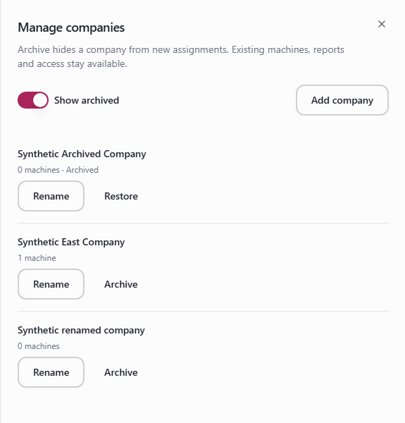
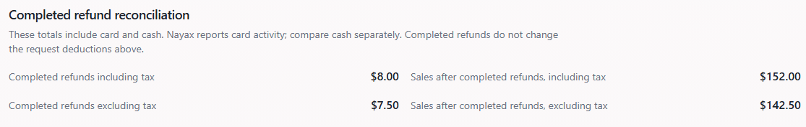

# Bloomjoy Finance team guide

Updated October 5, 2026. Screenshots show illustrative sample data, not company results. Sign in to follow the live links. English screen labels are preserved in both editions.

## 1. Start with Finance

[Open Finance](https://app.bloomjoyusa.com/portal/reports?view=finance)

- Choose **Company**, **Period** and **Location**. Open **More filters** for a machine. Sales use each machine's local business date. With no dates in the link, the initial period is the last seven completed days.
- Read **Sales including tax**, **Refund deductions including tax**, **Remaining tax**, then **Net sales excluding tax**. In this sample, $160.00 - $17.10 - $8.90 = $134.00. Net sales is a reporting amount; it is not profit or money deposited in the bank.
- Scroll to **By machine** and select a machine name to review it using the same period. **Save view** saves the filters for your account in this browser; it does not save a frozen report.
- **Export CSV** downloads Finance for the selected period and scope. Money columns are integer **cents**: 12345 means $123.45. Divide by 100 when formatting dollars in a spreadsheet. Keep the date, scope and coverage rows.

Quick links: [Sales](https://app.bloomjoyusa.com/portal/reports?view=sales) | [Refund reports](https://app.bloomjoyusa.com/refunds?view=reports) | [Timekeeping reports](https://app.bloomjoyusa.com/portal/time-review?view=reports)

Desktop Reporting tabs are **Overview**, **Sales**, **Finance**, **Locations**, and **Partners**, according to access. On a phone, use the **Report** selector. A link does not grant access; if expected Finance access remains missing after refreshing, ask the reporting administrator to check access.

---

## 2. Read the Finance breakdown

In Finance, open **Sales, tax and refund breakdown**.

- **Refund deductions including tax** combines requests, reversals and older paid deductions in their original collected amounts. The expanded excluding-tax breakdown is $15.00 - $2.00 + $3.00 = $16.00; the top-line including-tax deduction is $17.10. Requests reduce sales once; reversals restore deductions. Later payments and gift cards do not deduct again.
- **Money refunds paid in period** shows recorded money refunds. Gift-card **purchase value resolved**, **face value issued**, and **Bloomjoy-funded goodwill** are separate: in this sample a $10.00 gift resolves a $5.00 purchase with $5.00 goodwill.
- **Outstanding at [date]** is the balance at the selected period's end. Payments use recorded accounting dates; gifts use issuance dates. These amounts do not establish bank settlement or gift redemption.
- **Reporting tax removed** adjusts the reporting calculation; it does not establish tax collected or owed. Card tax comes automatically from the verified Nayax source setting for the purchase date, with actual original-transaction tax taking priority. Cash is untaxed: $10 collected counts as $10 of sales. Routine manual rate controls have been removed.

---

## 3. Choose a period and compare sales

[Open Overview](https://app.bloomjoyusa.com/portal/reports?view=overview)

- Open **Period** for a preset or **Custom range...**. For custom dates, enter **From** and **Through**, then **Apply dates**. Both dates are included. Finance, Overview, Locations, Refund reports and Timekeeping reports support up to 367 days. A period including today may be partial.
- Select **Location**; open **More filters** for **Machine**. Changing location clears the machine selection. In Overview and Locations, **Payment method** filters sales only. Check active filters before interpreting totals.
- **Compare** is available in Overview and Locations: **Previous period**, **Same days, prior month**, **Same dates, prior year**, or **No comparison**. Read the comparison dates shown below the filters. Finance has no comparison selector; Sales has its own detail controls.
- Missing or unequal comparison periods may show **Not comparable**. A percentage change requires a positive prior amount. A machine with records in only one period is not proof that it was newly installed or removed.

---

## 4. Use Sales for the detail

[Open Sales](https://app.bloomjoyusa.com/portal/reports?view=sales)

- Set **Company**, **Date range** and **Machine** in the **Operator performance** report. For specific dates, select the custom range and enter its dates. Read the filter summary directly below the controls.
- Open **More filters** to choose **Group results by** (Daily, Weekly or Monthly) and **Payment scope**. Sales uses these controls instead of the Overview comparison selector.
- Review the sales totals, period summary and trend. Scroll to **Detailed breakdown** and choose **View details** for machine and payment rows. Use **Export polished PDF** for the selected sales report.
- Under the shared sales basis, sales and refund impact exclude tax; refund payments are context, not another deduction. If older records use a different basis or an amount is unavailable, read the labels and coverage notes before comparing it with Finance. A sales row does not prove machine uptime.
- **Overview/Locations: Export PDF** creates a sales PDF; **Download briefing** creates a text summary. These exports are not the Finance CSV. Check each screen's filters before export.

---

## 5. Check refund resolution and balances

[Open Refund reports](https://app.bloomjoyusa.com/refunds?view=reports)

- Choose **Company**, **Period**, **Location** and, under **More filters**, **Machine**. Refund reports live in **Refunds**. From Overview, **View reports in Refunds** carries the selected dates and company/location/machine scope, checked against your Refund access.
- **Requests received in this period** follows requests received during the selected dates: their requested purchase value, resolution by period end and remaining balance. Duplicate requests count once; a request does not confirm a failed purchase.
- **Activity recorded in this period** follows the dates of payments, gift issuance and accounting changes. It can include older requests. Money refunds, gift purchase value, gift face value and goodwill describe different things; do not add them all as cash paid or deduct them again from net sales.
- **Outstanding across all requests** looks at all available request history as of period end, not only new requests in the period. **Report details** explains dates, missing records and historical deductions. Use **Export CSV** for the breakdown; Finance and Refunds totals can differ when their authorized machine scopes differ.
- In the CSV, check **Unit** and column labels: money is USD cents; other values are counts. **Unavailable** is not zero. **Known subtotal** includes only calculable amounts; an unknown balance is omitted, not assumed paid. Never replace unavailable amounts with zero in a reconciliation.

---

## 6. Find recorded labor in Timekeeping

[Open Timekeeping reports](https://app.bloomjoyusa.com/portal/time-review?view=reports)

- Open **Timekeeping**, then **Reports**, or follow the link above. From Overview, **View labor in Timekeeping** carries the selected dates and location/machine scope. Choose **Period**, **Location** and **Machine** as needed.
- **Recorded hours** is recorded time. **Time entries** counts entries. **Paid shifts** rounds each entry independently to a started hour: three 20-minute entries give one recorded hour and three paid shifts. Entries are not visits or staffing utilization.
- Scroll for weekly effort by location and machine. **Authorized account earnings** appears only with pay access; read its estimate, readiness and allocation notes. Published statements do not prove payment. Unallocated other earnings are not machine-level costs and are not automatically deducted from Finance net sales.
- Use **Export CSV** for recorded labor. **Open Pay Report**, when available, opens the pay report for the selected start month. Missing entries do not prove that no work occurred.
- The Timekeeping CSV distinguishes minutes, hours, shifts and earnings cents. Keep those units separate.

**If a report looks incomplete:** use **Retry** or **Try again** for loading errors. For empty results, check dates, location and machine. Read **Data coverage and metric definitions** in Reporting or **Report details** in Refunds. Recent imports do not prove complete records across every provider, machine and date.

Before using an export: confirm the period, authorized scope, units and coverage notes. If a discrepancy remains, share the report view, dates and machine/location with the team responsible for reporting; keep private customer and payment details out of general screenshots.

---

## 7. Compare companies and find their machines

[Open Sales](https://app.bloomjoyusa.com/portal/reports?view=sales) | [Open Refunds](https://app.bloomjoyusa.com/refunds)

- **All companies** shows the companies within your access. Select **Company** to narrow the report, available machines and export together. Overview, Sales, Locations, Finance and Refund reports each retain their own access rules; one report may show fewer companies than another.
- In Refunds, **Company** also narrows the case queue, its counts and search. A direct link to a case opens that authorized case even if your previous company filter was different. Deliberately choosing another company changes the queue again.
- Company grouping follows each machine's **current** company, including older activity. It does not rewrite the original sale/refund date or location. This is a management view, not a statement of legal ownership at the transaction date.
- Check the company label before exporting or sharing a saved view. If a company link is unavailable, select another permitted company or explicitly choose **All companies**. An unavailable selection never silently becomes every machine. Timekeeping and Partners use their own filters.
- Recorded sales and refund counts help identify what to review. Missing data is not zero, and these reports do not certify that a machine is online or operating normally.

---

## 8. Keep machine company assignments consistent

[Open Machines — authorized admins](https://app.bloomjoyusa.com/admin/machines)

- In a machine's edit form, choose an existing **Company** from the dropdown and save normally. The selection uses a stable company ID, so typing a spelling variation cannot create another company. The existing assignment is retained when you open an edit.
- If a company is genuinely new, use **Add company**, enter its name and select **Create company**. Creation is a separate action: it creates no invitation. Matching ignores capitalization and surrounding spaces and reuses an existing available company. Restore an archived company through **Manage companies** before using it again.
- When changing company, choose a location belonging to that company or explicitly add a location with its timezone. The old location and historical records remain intact. Company-level report access follows the selected company; machine manager assignments stay the same.
- **Cancel** leaves the machine draft intact. If the company was created but saving the machine fails, retry the machine save; the company already exists. If another admin changed the assignment, review the latest assignment before saving again.
- Company setup requires the existing machine administration permission. Finance users who only read reports can ask their machine administrator to correct an assignment. Imported-machine setup uses the same explicit company selection.

---

## 9. Rename or remove a company from choices

[Open Machines — authorized admins](https://app.bloomjoyusa.com/admin/machines)

- On **Machines**, select **Manage companies**. Use **Rename** to correct a name, then **Save**. The company keeps its identity and machine assignments. A name already used by another company cannot be reused.
- Select **Archive** to remove a company from choices for new machine assignments. Existing machines, reports and access remain available. Archiving does not move machines to another company or delete their records.
- Turn on **Show archived**, then select **Restore** to make a company available for new assignments again. If you are consolidating duplicate companies, reassign their machines to the correct company before archiving the duplicate.
- Merlin is a venue/partner grouping. Its machines belong under **Bloomjoy Enterprises**. Merlin venue names and partner agreements remain; company reporting groups those machines, including their historical activity, under Bloomjoy Enterprises.
- Company management requires **Super Admin** access. If another administrator changes a company while you are editing it, review the latest details and try again.

---

## 10. Compare completed refunds and check tax coverage

In Finance, scroll to **Completed refund reconciliation**.

- **Completed refunds including tax** and **Sales after completed refunds, including tax** provide a separate comparison. Here, $160.00 - $8.00 = $152.00. The request-based accounting result above remains $134.00; completing a refund does not deduct it twice.
- These totals include card and cash. Nayax reports card activity, so compare cash separately. Gift purchase value, gift face value and goodwill remain separate from money refunds.
- Current Nayax reader settings apply from their observation date. Earlier sales require dated historical evidence; a current setting does not prove last month's rate. Verified Finance confirmations cover only their stated machines and dates.
- If historical card tax is unknown, the inclusive sale or refund amount can remain known while **Remaining tax** and excluding-tax net sales show **Unavailable**. Unavailable is never zero. Existing issued snapshots keep their original calculation; fresh Finance CSVs identify the calculation policy.
- Authorized admins can inspect **Machines > Reporting > Tax source diagnostics**. A successful response missing the verified field makes coverage unresolved. A temporary Nayax refresh failure can retain previously verified evidence; it does not extend a bounded historical confirmation.
