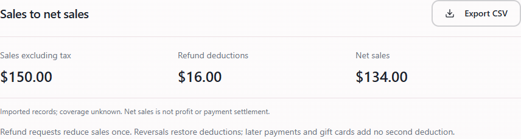
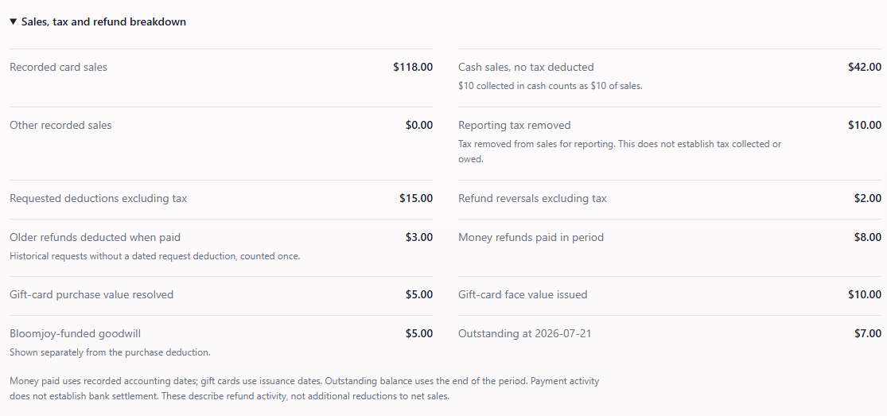
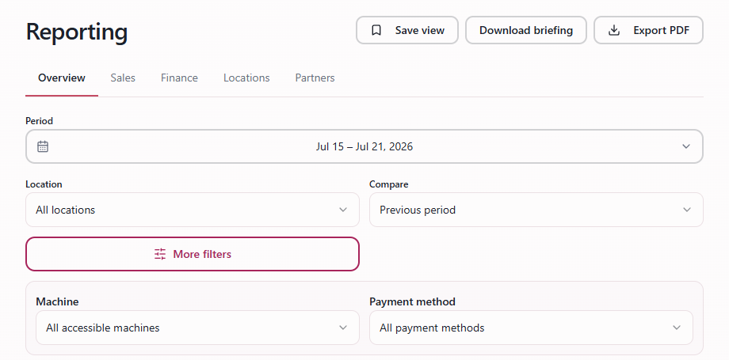
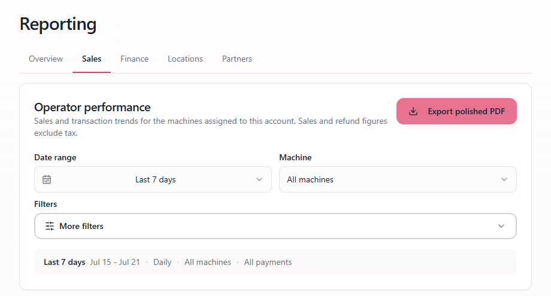
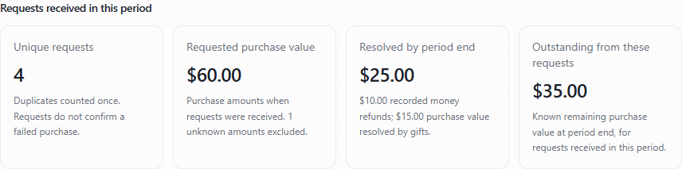
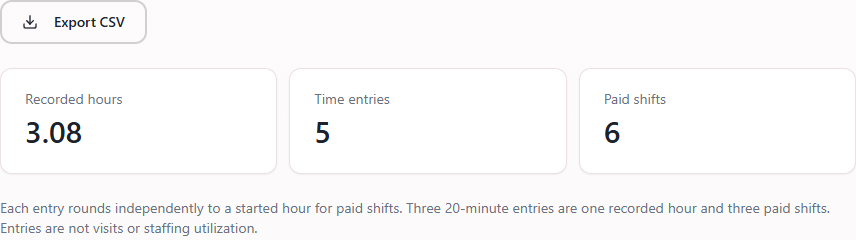
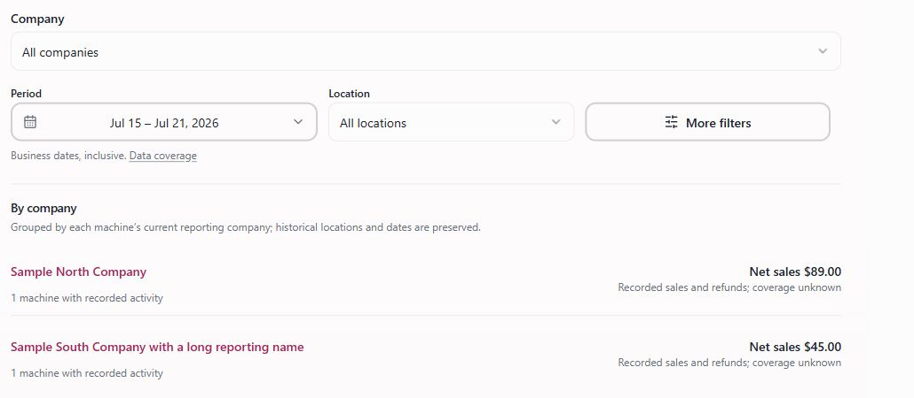
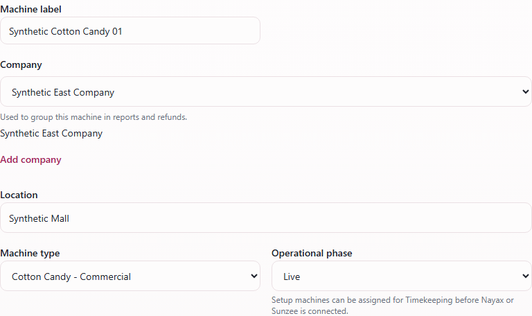

# Bloomjoy Finance team guide

Updated October 3, 2026. Screenshots and tax examples are illustrative, not company results or recommended tax rates. Sign in to follow the live links. English screen labels are preserved in both editions. Pages 9-12 cover reporting tax setup and reconciliation.

## 1. Start with Finance

[Open Finance](https://app.bloomjoyusa.com/portal/reports?view=finance)

- Choose **Company**, **Period** and **Location**. Open **More filters** for a machine. Sales use each machine's local business date. With no dates in the link, the initial period is the last seven completed days.
- Read **Sales excluding tax**, **Refund deductions**, then **Net sales**. In this sample, $150.00 - $16.00 = $134.00. Net sales is a reporting amount; it is not profit or money deposited in the bank.
- Scroll to **By machine** and select a machine name to review it using the same period. **Save view** saves the filters for your account in this browser; it does not save a frozen report.
- **Export CSV** downloads Finance for the selected period and scope. Money columns are integer **cents**: 12345 means $123.45. Divide by 100 when formatting dollars in a spreadsheet. Keep the date, scope and coverage rows.

Quick links: [Sales](https://app.bloomjoyusa.com/portal/reports?view=sales) | [Refund reports](https://app.bloomjoyusa.com/refunds?view=reports) | [Timekeeping reports](https://app.bloomjoyusa.com/portal/time-review?view=reports)

Desktop Reporting tabs are **Overview**, **Sales**, **Finance**, **Locations**, and **Partners**, according to access. On a phone, use the **Report** selector. A link does not grant access; if expected Finance access remains missing after refreshing, ask the reporting administrator to check access.

---

## 2. Read the Finance breakdown

In Finance, open **Sales, tax and refund breakdown**.

- **Refund deductions** = requested deductions - reversals + older refunds deducted when paid. Here, $15.00 - $2.00 + $3.00 = $16.00. Requests reduce sales once; reversals restore deductions. Later payments and gift cards do not deduct again.
- **Money refunds paid in period** shows recorded money refunds. Gift-card **purchase value resolved**, **face value issued**, and **Bloomjoy-funded goodwill** are separate: in this sample a $10.00 gift resolves a $5.00 purchase with $5.00 goodwill.
- **Outstanding at [date]** is the balance at the selected period's end. Payments use recorded accounting dates; gifts use issuance dates. These amounts do not establish bank settlement or gift redemption.
- **Reporting tax removed** adjusts the reporting calculation; it does not establish tax collected or owed. Some calculations may be estimates. Dated tax treatment in Machine Reporting affects reporting only; reading these reports does not require changing it.

---

## 3. Choose a period and compare sales

[Open Overview](https://app.bloomjoyusa.com/portal/reports?view=overview)

- Open **Period** for a preset or **Custom range...**. For custom dates, enter **From** and **Through**, then **Apply dates**. Both dates are included. Finance, Overview, Locations, Refund reports and Timekeeping reports support up to 367 days. A period including today may be partial.
- Select **Location**; open **More filters** for **Machine**. Changing location clears the machine selection. In Overview and Locations, **Payment method** filters sales only. Check active filters before interpreting totals.
- **Compare** is available in Overview and Locations: **Previous period**, **Same days, prior month**, **Same dates, prior year**, or **No comparison**. Read the comparison dates shown below the filters. Finance has no comparison selector; Sales has its own detail controls.
- Missing or unequal comparison periods may show **Not comparable**. A percentage change requires a positive prior amount. A machine with records in only one period is not proof that it was newly installed or removed.

---

## 4. Use Sales for the detail

[Open Sales](https://app.bloomjoyusa.com/portal/reports?view=sales)

- Set **Company**, **Date range** and **Machine** in the **Operator performance** report. For specific dates, select the custom range and enter its dates. Read the filter summary directly below the controls.
- Open **More filters** to choose **Group results by** (Daily, Weekly or Monthly) and **Payment scope**. Sales uses these controls instead of the Overview comparison selector.
- Review the sales totals, period summary and trend. Scroll to **Detailed breakdown** and choose **View details** for machine and payment rows. Use **Export polished PDF** for the selected sales report.
- Under the shared sales basis, sales and refund impact exclude tax; refund payments are context, not another deduction. If older records use a different basis or an amount is unavailable, read the labels and coverage notes before comparing it with Finance. A sales row does not prove machine uptime.
- **Overview/Locations: Export PDF** creates a sales PDF; **Download briefing** creates a text summary. These exports are not the Finance CSV. Check each screen's filters before export.

---

## 5. Check refund resolution and balances

[Open Refund reports](https://app.bloomjoyusa.com/refunds?view=reports)

- Choose **Company**, **Period**, **Location** and, under **More filters**, **Machine**. Refund reports live in **Refunds**. From Overview, **View reports in Refunds** carries the selected dates and company/location/machine scope, checked against your Refund access.
- **Requests received in this period** follows requests received during the selected dates: their requested purchase value, resolution by period end and remaining balance. Duplicate requests count once; a request does not confirm a failed purchase.
- **Activity recorded in this period** follows the dates of payments, gift issuance and accounting changes. It can include older requests. Money refunds, gift purchase value, gift face value and goodwill describe different things; do not add them all as cash paid or deduct them again from net sales.
- **Outstanding across all requests** looks at all available request history as of period end, not only new requests in the period. **Report details** explains dates, missing records and historical deductions. Use **Export CSV** for the breakdown; Finance and Refunds totals can differ when their authorized machine scopes differ.
- In the CSV, check **Unit** and column labels: money is USD cents; other values are counts. **Unavailable** is not zero. **Known subtotal** includes only calculable amounts; an unknown balance is omitted, not assumed paid. Never replace unavailable amounts with zero in a reconciliation.

---

## 6. Find recorded labor in Timekeeping

[Open Timekeeping reports](https://app.bloomjoyusa.com/portal/time-review?view=reports)

- Open **Timekeeping**, then **Reports**, or follow the link above. From Overview, **View labor in Timekeeping** carries the selected dates and location/machine scope. Choose **Period**, **Location** and **Machine** as needed.
- **Recorded hours** is recorded time. **Time entries** counts entries. **Paid shifts** rounds each entry independently to a started hour: three 20-minute entries give one recorded hour and three paid shifts. Entries are not visits or staffing utilization.
- Scroll for weekly effort by location and machine. **Authorized account earnings** appears only with pay access; read its estimate, readiness and allocation notes. Published statements do not prove payment. Unallocated other earnings are not machine-level costs and are not automatically deducted from Finance net sales.
- Use **Export CSV** for recorded labor. **Open Pay Report**, when available, opens the pay report for the selected start month. Missing entries do not prove that no work occurred.
- The Timekeeping CSV distinguishes minutes, hours, shifts and earnings cents. Keep those units separate.

**If a report looks incomplete:** use **Retry** or **Try again** for loading errors. For empty results, check dates, location and machine. Read **Data coverage and metric definitions** in Reporting or **Report details** in Refunds. Recent imports do not prove complete records across every provider, machine and date.

Before using an export: confirm the period, authorized scope, units and coverage notes. If a discrepancy remains, share the report view, dates and machine/location with the team responsible for reporting; keep private customer and payment details out of general screenshots.

---

## 7. Compare companies and find their machines

[Open Sales](https://app.bloomjoyusa.com/portal/reports?view=sales) | [Open Refunds](https://app.bloomjoyusa.com/refunds)

- **All companies** shows the companies within your access. Select **Company** to narrow the report, available machines and export together. Overview, Sales, Locations, Finance and Refund reports each retain their own access rules; one report may show fewer companies than another.
- In Refunds, **Company** also narrows the case queue, its counts and search. A direct link to a case opens that authorized case even if your previous company filter was different. Deliberately choosing another company changes the queue again.
- Company grouping follows each machine's **current** company, including older activity. It does not rewrite the original sale/refund date or location. This is a management view, not a statement of legal ownership at the transaction date.
- Check the company label before exporting or sharing a saved view. If a company link is unavailable, select another permitted company or explicitly choose **All companies**. An unavailable selection never silently becomes every machine. Timekeeping and Partners use their own filters.
- Recorded sales and refund counts help identify what to review. Missing data is not zero, and these reports do not certify that a machine is online or operating normally.

---

## 8. Keep machine company assignments consistent

[Open Machines — authorized admins](https://app.bloomjoyusa.com/admin/machines)

- In a machine's edit form, choose an existing **Company** from the dropdown and save normally. The selection uses a stable company ID, so typing a spelling variation cannot create another company. The existing assignment is retained when you open an edit.
- If a company is genuinely new, use **Add company**, enter its name and select **Create company**. Creation is a separate action: it creates no invitation. An exact name match ignores capitalization and surrounding spaces and reuses the existing company.
- When changing company, choose a location belonging to that company or explicitly add a location with its timezone. The old location and historical records remain intact. Company-level report access follows the selected company; machine manager assignments stay the same.
- **Cancel** leaves the machine draft intact. If the company was created but saving the machine fails, retry the machine save; the company already exists. If another admin changed the assignment, review the latest assignment before saving again.
- Company setup requires the existing machine administration permission. Finance users who only read reports can ask their machine administrator to correct an assignment. Imported-machine setup uses the same explicit company selection.

---

## 9. Set a machine's reporting tax rate

[Open Machines](https://app.bloomjoyusa.com/admin/machines)

These settings change reporting calculations for a machine and dated activity. They do not change the machine's customer price, provider tax collection, Stripe Checkout, or a tax filing. Viewing Finance does not grant tax-edit access; scoped admins can edit only their permitted machines.

- **Step 1:** Open the machine and select **Reporting**. Confirm its machine name, company and location. Select **Set tax rate** for initial setup or **Change tax rate** for an existing rate. Use **Rate history** to check saved rates and their date ranges.
- **Step 2:** Enter **New reporting tax %**, from 0 to 100. Enter 8.25 for 8.25%, not 0.0825. Use the documented rate for that machine and period. A saved 0% is an explicit no-tax reporting setting; a missing rate is incomplete configuration, not evidence of exemption.
- **Step 3:** Choose **Applies from**, the first date the setting should apply. Initial setup defaults to January 1, 2026; confirm that date against the actual history. A change defaults to today. The previous rate ends the day before the new start. Backdating can change reports for earlier periods.
- **Step 4:** Enter **Reason** (at least eight characters), explaining the change and its source. Open **Tax treatment (optional)** if the source basis or taxable portion also needs changing; see page 10. These controls use the same effective date and reason.
- **Step 5:** Select **Set tax rate** or **Save rate change**. Reopen the machine's Reporting section and check **Rate history**. To check card/cash treatment, reopen the dialog, select the relevant **Applies from** date and expand the controls. Return to Finance, refresh, and export the same machine and dates again.

If saving reports an error or an uncertain result, refresh and inspect the saved settings before retrying. If treatment loading fails, **Retry treatment** reloads it; the UI still permits a rate-only save that preserves existing treatment. Editing treatment requires the saved treatment to load.

---

## 10. Choose the source basis and taxable portion

In the tax dialog, expand **Tax treatment (optional)**. Set **Card source amounts** and **Cash source amounts** separately. These describe the particular imported sales amount, not every field from that provider and not the amount of a customer refund.

- **Automatic:** preserves the source's reporting basis. It does not discover local tax law or guarantee that every source field includes tax. When no dated treatment exists, the defaults are Automatic and 100% taxable portion. Missing or unknown basis can still produce incomplete coverage.
- **Includes tax:** the imported sales amount already contains embedded tax. Where separate recorded tax is unavailable, the report can calculate the tax-exclusive amount using the dated rate and taxable portion. This prevents treating a customer-charge total as tax-exclusive revenue.
- **Excludes tax:** the imported sales amount is already tax-exclusive. Do not subtract tax from that amount again. This setting does not mean the customer was charged no tax or that the sale is legally exempt.
- Expand **Taxable portion**. Enter **Card taxable %** and **Cash taxable %**, each from 0 to 100. The portion is the share of tax-exclusive purchase value subject to the entered rate, not the percentage of transactions paid by card or cash. 100% applies the full rate; 0% removes no estimated tax.
- **Effective reporting rate = entered tax rate x taxable portion / 100.** A sample 10% rate with a 50% portion produces a 5% effective reporting rate. The card and cash portions can differ when their documented treatment differs. Do not copy a location's exception to all machines without matching scope and dates.

Recorded tax details remain authoritative. Source overrides affect reporting assumptions; customer-charge refund amounts retain their own tax basis. A tax-exclusive provider sales field does not prove that the related customer charge or refund excludes tax.

Keep the machine/location, provider, exact report or field, amount basis, rate, taxable portion, effective date and supporting record together. For example, a source's Order amount and Payment amount can have different bases. Confirm which field was imported before choosing an override.

---

## 11. Worked tax examples

All amounts and rates below are invented. The examples assume no separate recorded tax, a known source basis and the applicable dated configuration. They explain reporting arithmetic, not the tax treatment required for any location.

- **Fully taxable, Includes tax:** recorded sales $110.00; rate 10%; portion 100%. Effective rate = 10%. Sales excluding tax = $110.00 / 1.10 = **$100.00**. Reporting tax removed = **$10.00**. Do not simply subtract 10% of $110.00: embedded tax is calculated on the tax-exclusive base.
- **Partly taxable, Includes tax:** recorded sales $105.00; rate 10%; portion 50%. Effective rate = 5%. Sales excluding tax = $105.00 / 1.05 = **$100.00**. Reporting tax removed = **$5.00**. The taxable portion is $50.00 of the $100.00 base.
- **Excludes tax:** recorded sales $100.00; rate 10%; portion 100%. Sales excluding tax remains **$100.00**; no embedded tax is removed from that source amount. The setting does not add $10.00 to this sales value or prove how much the customer actually paid.
- **Refund impact:** with a separately proved $11.00 tax-inclusive purchase deduction at 10% and 100% taxable portion, the tax-exclusive deduction is **$10.00**. If sales excluding tax are $100.00, net sales after that deduction are **$90.00**. Paying the recorded $11.00 refund later does not deduct another $11.00 from net sales.
- **Date change:** if a new rate starts October 1, September activity keeps its applicable September rate. A report spanning both dates uses dated settings; applying the October rate to the entire period in a spreadsheet can produce a difference.

For an inclusive source, the simplified formula is **tax-exclusive sales = recorded amount / (1 + effective reporting rate / 100)**; tax removed is the difference. Actual totals can differ by cents because normalization rounds within the system's grouping and uses recorded tax when available. Compare the exported calculated amounts rather than rounding every transaction independently.

If a rate, basis or amount is missing, read the coverage note. **Unavailable** is not zero; a **Known subtotal** omits unknown amounts. A numeric display does not by itself prove complete tax coverage.

---

## 12. Reconcile and keep a period-end copy

[Open Finance](https://app.bloomjoyusa.com/portal/reports?view=finance) | [Stripe Tax reporting reference](https://docs.stripe.com/tax/reports)

- **Choose a common scope:** use the same completed dates, company, location and machines across Finance, Sales and Refund reports. Confirm each account's authorized scope. Compare the machine's local business dates with the timezone used by the provider export. Payment-method filters on Overview/Locations affect sales only.
- **Trace the sales basis:** compare the selected machine/day sales to the source export. Record the exact field, whether it includes tax, and any separate tax field. Use the applicable dated rate and card/cash treatment. Check coverage, delayed imports and cash uploaded after an offline period before treating absent records as zero.
- **Tie the deductions:** reconcile requested deductions, reversals and older refunds deducted when paid to Finance. Money refunds paid and gift-card resolution explain activity; they are not extra deductions. Keep gift face value and goodwill separate from purchase value and cash outflows.
- **Export a dated copy:** keep the Finance CSV, the selected Sales PDF, relevant Refund CSV and supporting source exports with the scope, download date and tax-setting evidence. Finance CSV money is cents. **Save view** saves filters only; reopening it can reflect later imports, corrected rates or current company assignments.
- **Bridge to cash and costs separately:** net sales is not profit or a bank payout. Reconcile provider payouts using their fees, settlement timing and refunds, and reconcile physical cash using collection records. Review Timekeeping/pay reports separately; labor and unallocated earnings are not automatically deducted from Finance net sales.
- **Use collection evidence for tax filing:** reporting tax removed is a calculation adjustment. Reconcile actual collected tax and tax reversals with the appropriate provider/tax records. Stripe Tax exports cover completed transactions with Stripe Tax enabled; they are not automatically the machine card/cash ledger. Select the correct legal entity/account, dates and currency. Stripe notes that completed transactions can take up to 24 hours to appear in its tax reports; see the linked reference.

For an unresolved difference, record the report link, filters, machine/day, expected versus displayed amount, source field and coverage note. Give this to the reporting administrator or finance owner. A screen access issue belongs with the access administrator; documented rate/basis corrections belong with an authorized machine administrator. Preserve customer and payment identifiers in private reconciliation records.
